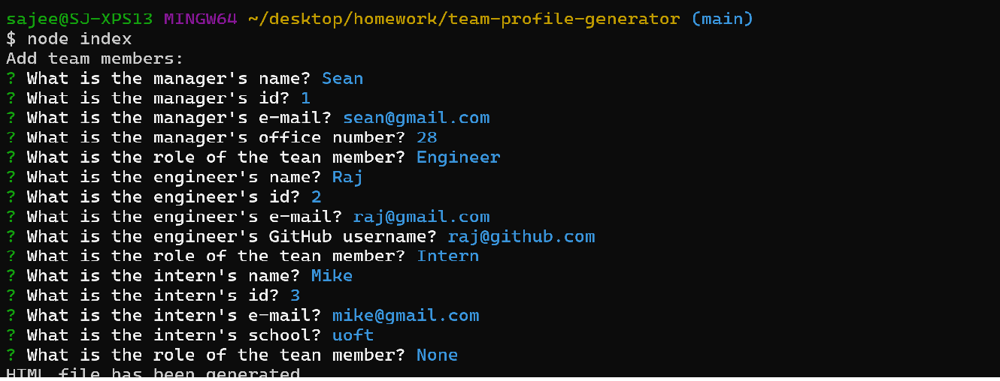

# Team Profile Page Generator

## Description 

This is a Node.js command-line application that collects user information about their given team and generates an HTML file from that input. 

## User Story

AS A manager  
I WANT to generate a webpage that displays my team's basic info  
SO THAT I have quick access to their emails and GitHub profiles  

## Acceptance Criteria

GIVEN a command-line application that accepts user input  
WHEN I am prompted for my team members and their information  
THEN an HTML file is generated that displays a nicely formatted team roster based on user input  
WHEN I click on an email address in the HTML  
THEN my default email program opens and populates the TO field of the email with the address  
WHEN I click on the GitHub username  
THEN that GitHub profile opens in a new tab  
WHEN I start the application  
THEN I am prompted to enter the team manager’s name, employee ID, email address, and office number  
WHEN I enter the team manager’s name, employee ID, email address, and office number  
THEN I am presented with a menu with the option to add an engineer or an intern or to finish building my team  
WHEN I select the engineer option  
THEN I am prompted to enter the engineer’s name, ID, email, and GitHub username, and I am taken back to the menu  
WHEN I select the intern option  
THEN I am prompted to enter the intern’s name, ID, email, and school, and I am taken back to the menu  
WHEN I decide to finish building my team  
THEN I exit the application, and the HTML is generated  

## Table of Contents

  * [Installation](##-installation)
  * [License](##-license)
  * [Screenshot](##-screenshot)
  * [Video](##-video)
  * [Usage](##-usage)
  * [Testing](##-testing)
  * [Contact](##-contact)

## Installation
To install the necessary dependencies, run the following command: npm install i to install inquirer. 

## License 

## Screenshot 

## Video
[Link to Demo](https://watch.screencastify.com/v/3Id8MWpoKSoy9KWZeT1i)

## Usage 
Type node index.js from the directory the file is in. The new html will be created and found in the dist directory. 

## Testing 
To run tests, tun the following command: npm test

## Contact 
At [GitHub](https://github.com/sajees89)
